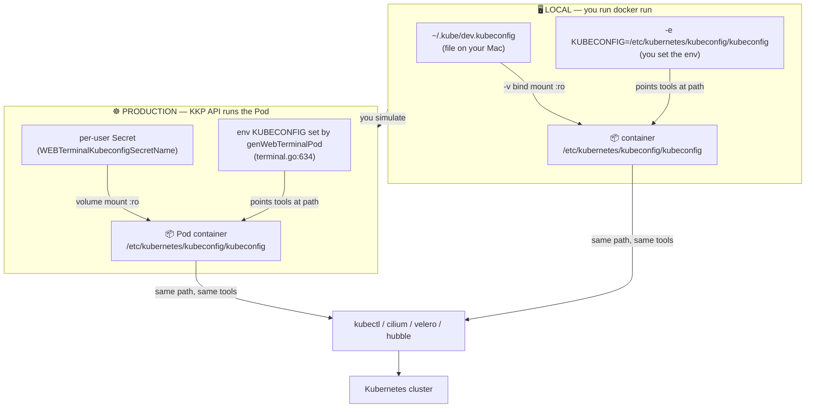
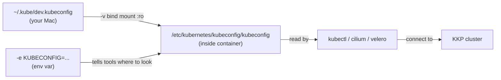
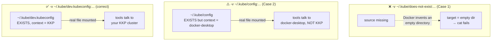

# Web-terminal local smoke-test command

```bash
docker run --rm -it \
  -e KUBECONFIG=/etc/kubernetes/kubeconfig/kubeconfig \
  -e PS1='\s-\v \w \$ ' \
  -v "$HOME/.kube/dev.kubeconfig:/etc/kubernetes/kubeconfig/kubeconfig:ro" \
  web-terminal:test bash -l
```

> Use `~/.kube/dev.kubeconfig` (the KKP cluster), **not** `~/.kube/config`. See the
> [Common gotcha](#common-gotcha-the-source-path-must-exist) section for why the wrong
> source path silently breaks the mount.

This starts a throwaway container that mimics how the KKP API runs the web-terminal Pod
(`terminal.go`, `genWebTerminalPod`), then drops you into an interactive login shell.

## Mental model: local test ↔ real Pod

The whole point of this command is to **fake, on your laptop, the exact setup the KKP API builds
in production**. Both sides feed a kubeconfig to the same CLI tools at the same path. The only
difference is *where the kubeconfig comes from* and *who sets it up*.



| Concept | Local (`docker run`) | Real Pod (KKP API) |
|---------|----------------------|--------------------|
| Where kubeconfig lives | `~/.kube/dev.kubeconfig` on your Mac | A per-user Kubernetes **Secret** |
| How it gets inside | `-v` bind mount (read-only) | Volume mount from the Secret (read-only) |
| Path inside container | `/etc/kubernetes/kubeconfig/kubeconfig` | **same** `/etc/kubernetes/kubeconfig/kubeconfig` |
| Who sets `KUBECONFIG` env | You, via `-e` | `genWebTerminalPod` (`terminal.go:634`) |
| Tools that read it | `kubectl` / `cilium` / `velero` / `hubble` | **same** tools |

Because the **path and the tools are identical**, if the CLIs work locally they'll work in the
real Pod. That's why this is a faithful smoke test, not just "did the binary launch."

## Breakdown

| Part | Meaning |
|------|---------|
| `docker run` | Create and start a new container. |
| `--rm` | Auto-delete the container when it exits — no leftover stopped container. |
| `-it` | `-i` keeps STDIN open, `-t` allocates a pseudo-TTY. Together they give you a usable interactive terminal. |
| `-e KUBECONFIG=/etc/kubernetes/kubeconfig/kubeconfig` | Sets `KUBECONFIG` to the exact path the API injects in the real Pod (`terminal.go:634`). Makes kube tools look there for cluster credentials. |
| `-e PS1='\s-\v \w \$ '` | Sets the bash prompt string (shell name-version, working dir, `$`) — purely cosmetic, matches the Pod's prompt. |
| `-v "$HOME/.kube/dev.kubeconfig:/etc/kubernetes/kubeconfig/kubeconfig:ro"` | Bind-mounts your local `~/.kube/dev.kubeconfig` into the container at the `KUBECONFIG` path, read-only (`:ro`). Stands in for the per-user kubeconfig secret the API mounts in the real Pod. |
| `web-terminal:test` | The image to run (the tag you built locally). |
| `bash -l` | The command: start bash as a login shell (`-l`), so it sources `/etc/profile`, `.bashrc`, etc. |

## What a bind mount (`-v`) actually is

A container is a **sealed room** — it cannot see any file on your Mac. The `-v` flag cuts a
**window** in the wall so one file/folder on your Mac becomes visible at a chosen spot inside the
container. The format is three colon-separated parts:

```
-v   SOURCE (on your Mac)   :   TARGET (inside container)   :   ro
        what to show              where it appears             read-only
```

The container has **no kubeconfig of its own**. The only reason
`/etc/kubernetes/kubeconfig/kubeconfig` exists inside is *because the mount puts it there*.
No mount → no file.

Two pieces do two different jobs — you need **both**:

| Piece | Job | Analogy |
|-------|-----|---------|
| `-v ...dev.kubeconfig:...` | Makes the file *exist* inside the container | Puts the book on the shelf |
| `-e KUBECONFIG=...` | Tells the tools *where* to look | Hands you the shelf address |



## Common gotcha: the source path must be the *right, existing* file

A wrong `-v` source fails in one of **two** ways — and both are easy to miss because the container
still starts fine:

**Case 1 — source doesn't exist → empty directory.**
If the source path doesn't exist on your Mac, **Docker does NOT error.** It silently creates an
empty *directory* at that path and mounts that empty directory at the target. So inside the
container `/etc/kubernetes/kubeconfig/kubeconfig` shows up — but as an **empty directory**, not a
file. That's why `cat /etc/kubernetes/kubeconfig/kubeconfig` fails (you can't `cat` a directory)
even though the shell launched.

**Case 2 — source exists but points to the *wrong cluster*.**
This is the one that actually bit here. `~/.kube/config` **does exist**, but its current context is
**docker-desktop**, not your KKP cluster. Mounting it "works" (the file is real, `cat` shows
contents), but every kube command then talks to **docker-desktop** instead of KKP — a silent wrong
target, not an error. Your KKP credentials live in a **separate** file, `~/.kube/dev.kubeconfig`,
which is why that's the correct source to mount.

In both cases the container "ran successfully" because **starting the shell has nothing to do with
the kubeconfig** — `bash -l` launches with or without a valid one. A bad mount only bites when a
kube command actually reads the file.



**Avoid both traps:** confirm the source exists *and* is the KKP file before `docker run`:

```bash
ls -l "$HOME/.kube/dev.kubeconfig"                       # Case 1: path must exist
kubectl --kubeconfig "$HOME/.kube/dev.kubeconfig" config current-context   # Case 2: must be KKP, not docker-desktop
```

## What it achieves

It reproduces the two things the backend sets up in the real terminal Pod — the `KUBECONFIG`
env var and a read-only kubeconfig mount at the same path — so the new CLIs (`cilium`, `velero`,
`hubble`) resolve cluster access exactly as they would inside the Pod, but locally without a KKP
cluster. Because of `--rm` and the read-only mount, it's non-destructive: nothing persists and
your real `~/.kube/config` can't be modified from inside the container.

## Caveat

The mounted kubeconfig may reference paths (certs, tokens) or a `server:` address (e.g.
`127.0.0.1`) that aren't valid inside the container, so cluster-aware commands could fail even
though `--client` / `version` checks work. That's expected for a local smoke test.

## Verify the CLIs once inside the shell

First confirm the **right** kubeconfig actually landed inside the container. Compare what's inside
the container against the host file — they must be identical:

```bash
# inside the container
cat /etc/kubernetes/kubeconfig/kubeconfig     # must print the file (not "Is a directory")
kubectl config current-context                # must be your KKP context, NOT docker-desktop
```

```bash
# on your Mac, in another terminal — should match the container output above
cat "$HOME/.kube/dev.kubeconfig"
```

Then smoke-test the CLIs:

```bash
echo "KUBECONFIG=$KUBECONFIG"
cilium version --client
velero version --client-only
hubble version
```


---

docker run --rm -it \
  -v "$HOME/.kube/dev.kubeconfig:/etc/kubernetes/kubeconfig/kubeconfig:ro" \
  web-terminal:test bash -l

docker run --rm -it \
  -v "$HOME/.kube/dev.kubeconfig:/etc/kubernetes/kubeconfig/kubeconfig:ro" \
  web-terminal:test bash -l