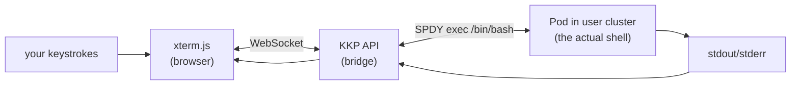
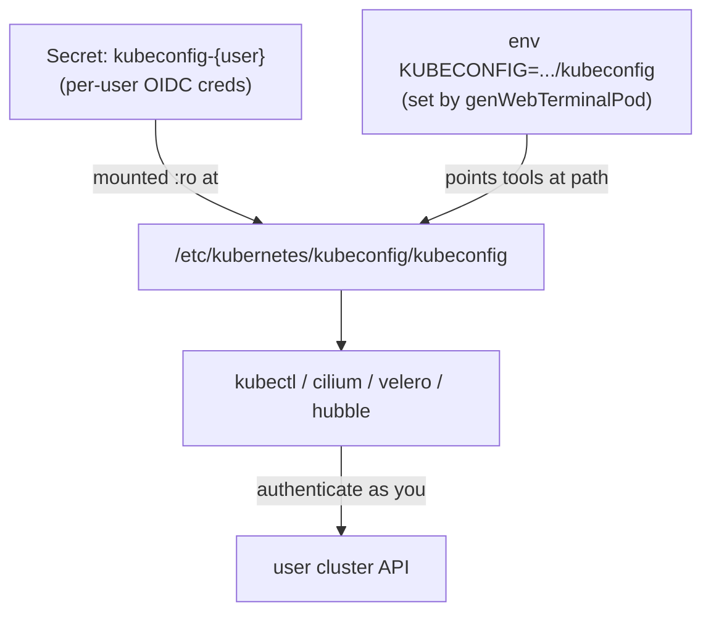
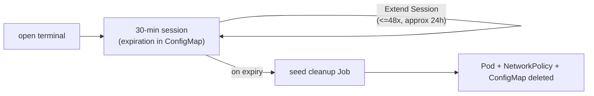
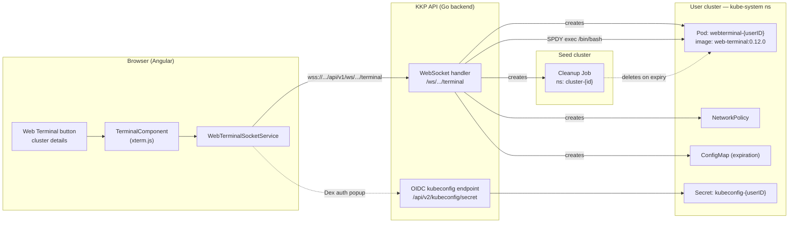
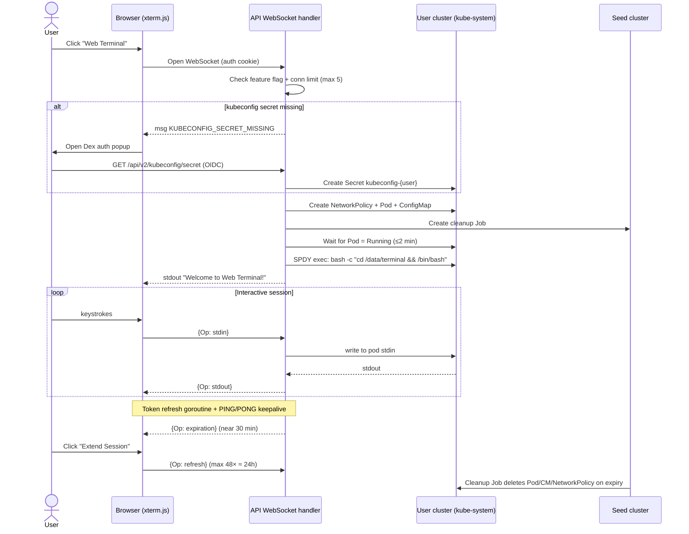

# Web Terminal — How It Currently Works

How the KKP Dashboard "Web Terminal" feature works end-to-end: what gets created in
Kubernetes, how the browser connects, and how the session is managed and cleaned up.

## TL;DR

- Opening a Web Terminal creates a **single Pod** (not a Deployment / StatefulSet / Job)
  named `webterminal-{userEmailID}` in the **`kube-system` namespace of the user cluster**.
- Image: `quay.io/kubermatic/web-terminal:0.12.0` (`resources.WEBTerminalImage`).
- The browser attaches to that Pod over a **WebSocket**, which the API backend bridges to a
  Kubernetes **SPDY `exec`** session running `/bin/bash` inside the Pod.
- Alongside the Pod, the backend creates a **NetworkPolicy** and an expiration **ConfigMap**
  (user cluster, `kube-system`) plus a **cleanup Job** on the **seed cluster** that deletes
  everything when the session expires.

## Kubernetes resources created

| Resource | Type | Cluster | Namespace | Purpose |
|----------|------|---------|-----------|---------|
| `webterminal-{userID}` | Pod | User cluster | `kube-system` | Runs the shell the user interacts with |
| `webterminal-{userID}` | NetworkPolicy | User cluster | `kube-system` | Restricts ingress/egress (API server + DNS, or internet if enabled) |
| `webterminal-{userID}` | ConfigMap | User cluster | `kube-system` | Stores expiration timestamp + refresh count |
| `kubeconfig-{userID}` | Secret | User cluster | `kube-system` | Per-user OIDC kubeconfig mounted into the Pod |
| cleanup Job | Job | **Seed cluster** | `cluster-{clusterID}` | Deletes Pod/ConfigMap/NetworkPolicy on expiry |

The Pod runs `/bin/bash -c -- "while true; do sleep 30; done;"` as a keep-alive; the
interactive shell is started later via `exec`.

## Why a Pod (and not a Deployment)?

The terminal is an ephemeral, per-user, single-session workload with a strict TTL. A bare Pod
is created on demand and torn down on expiry by the cleanup Job — there is no need for the
self-healing / replica semantics a Deployment would add. One Pod maps to one user's terminal
session(s).

## Mental model

Three simple ideas capture the whole feature. If you remember these, the detailed diagrams below
just fill in the wiring.

**1. It's just a remote bash, piped to your browser.** The Pod runs an idle keep-alive loop; your
keystrokes travel browser → WebSocket → backend → `exec` into the Pod, and output comes back the
same way. Nothing runs in your browser — the shell lives in the user cluster.

**2. The Pod's cluster powers come entirely from a mounted kubeconfig.** The image ships the tools
(`kubectl`, `cilium`, `velero`, `hubble`, …) but no credentials. The backend mounts a **per-user
Secret** at `/etc/kubernetes/kubeconfig/kubeconfig` (read-only) and sets `KUBECONFIG` to that path,
so every tool authenticates as *you*. This is exactly what the local `docker run -v ... -e
KUBECONFIG=...` smoke test imitates.

**3. It self-destructs.** Every session has a TTL written to a ConfigMap; a Job on the seed cluster
watches it and deletes the Pod + NetworkPolicy + ConfigMap on expiry. You can extend, but there's a
hard ceiling — nothing lingers.

## Component overview

## Sequence: what happens when the user opens the terminal

## Connection & exec mechanism

- **WebSocket route:** `GET /ws/projects/{project_id}/clusters/{cluster_id}/terminal`.
- **Auth:** session cookie is sent automatically on the WebSocket handshake (no bearer header).
- **Exec:** the backend uses the Kubernetes `remotecommand` SPDY executor to exec into the Pod
  (`bash -c "cd /data/terminal && /bin/bash"`) and streams stdin/stdout/stderr over the socket.
- **Message protocol (JSON):** `stdin`, `stdout`, `resize`, `refresh`, `expiration`, `msg`
  (PING/PONG keepalive, token status, error codes such as `KUBECONFIG_SECRET_MISSING`,
  `CONNECTION_POOL_EXCEEDED`, `WEBTERMINAL_POD_PENDING`).

## Lifecycle & limits

- **Pod lifetime:** 30 minutes per session.
- **Refreshes:** up to 48 extensions (~24h total) before a hard stop.
- **Concurrency:** max 5 concurrent sessions per user.
- **Cleanup:** the seed-cluster Job checks the expiration ConfigMap roughly every minute and
  deletes the Pod, ConfigMap, and NetworkPolicy once expired.
- **Token refresh:** a backend goroutine refreshes the user's OIDC token before expiry and
  surfaces `WEBTERMINAL_TOKEN_VALID` / `WEBTERMINAL_TOKEN_EXPIRED` status to the UI.

## Feature gating

The Web Terminal button is shown only when both are enabled in admin settings:

- `enableOIDCKubeconfig` (OIDC kubeconfig must be on), and
- `webTerminalOptions.enabled` (master switch; legacy field `enableWebTerminal`).

Additional options: `webTerminalOptions.enableInternetAccess` (loosens the NetworkPolicy egress)
and `additionalEnvironmentVariables` (extra env vars injected into the Pod).

## The web-terminal image

Built from `hack/images/web-terminal/Dockerfile`. Ships a shell plus cluster tooling (kubectl,
helm, k9s, krew, oidc-login, etc.). The backend injects `KUBECONFIG=/etc/kubernetes/kubeconfig/kubeconfig`
(read-only per-user kubeconfig) and a cosmetic `PS1`. Any binary on `PATH` in the image is
automatically available in the terminal.

## Key source references

| Aspect | File |
|--------|------|
| Pod / NetworkPolicy / ConfigMap / cleanup Job generation + exec | [modules/api/pkg/handler/websocket/terminal.go](../../modules/api/pkg/handler/websocket/terminal.go) |
| WebSocket route + auth/feature checks | [modules/api/pkg/handler/routes_v1_websocket.go](../../modules/api/pkg/handler/routes_v1_websocket.go) |
| OIDC kubeconfig secret endpoint | [modules/api/pkg/handler/v2/routes_v2.go](../../modules/api/pkg/handler/v2/routes_v2.go) |
| Terminal UI (xterm.js) | [modules/web/src/app/shared/components/terminal/component.ts](../../modules/web/src/app/shared/components/terminal/component.ts) |
| WebSocket service | [modules/web/src/app/core/services/websocket.ts](../../modules/web/src/app/core/services/websocket.ts) |
| Web Terminal button | [modules/web/src/app/cluster/details/cluster/template.html](../../modules/web/src/app/cluster/details/cluster/template.html) |
| Terminal image | [hack/images/web-terminal/Dockerfile](../../hack/images/web-terminal/Dockerfile) |
