# Headlamp Migration Investigation

> Investigation into how Kubernetes Dashboard is currently deployed per user cluster in KKP,
> and the challenges of switching to Headlamp.
>
> Tracking Issue: [kubermatic/kubermatic#15287](https://github.com/kubermatic/kubermatic/issues/15287)

---

## Table of Contents

1. [Current Architecture Overview](#1-current-architecture-overview)
2. [Deployment Layer (kubermatic/kubermatic)](#2-deployment-layer)
3. [API Proxy Layer (kubermatic/dashboard)](#3-api-proxy-layer)
4. [Frontend Layer (Angular)](#4-frontend-layer)
5. [End-to-End Flow: Opening the Dashboard](#5-end-to-end-flow)
6. [Headlamp Overview](#6-headlamp-overview)
7. [Migration Challenges](#7-migration-challenges)
8. [Required Changes Per Repository](#8-required-changes-per-repository)
9. [Recommended Approach](#9-recommended-approach)
10. [Open Questions](#10-open-questions)

---

## 1. Current Architecture Overview

The Kubernetes Dashboard integration in KKP operates across **three layers** spanning **two repositories**:

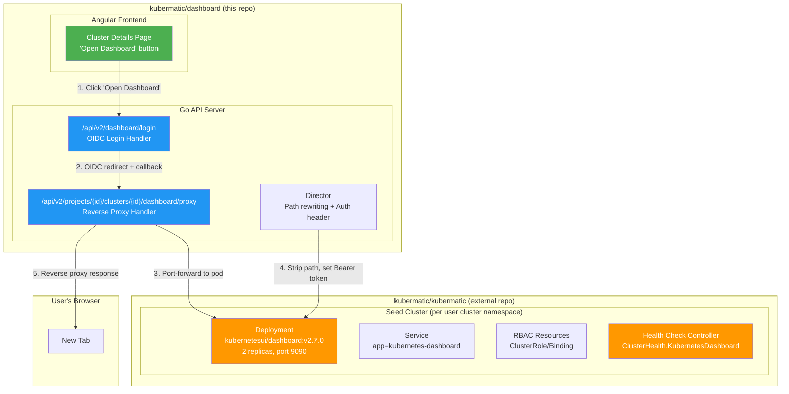

### Key Configuration Points

| Setting | Location | Default | Purpose |
|---------|----------|---------|---------|
| `GlobalSettings.EnableDashboard` | Admin Settings | `true` | Global on/off for all clusters |
| `ClusterSpec.KubernetesDashboard.Enabled` | Per-Cluster | `true` | Per-cluster deployment toggle |
| `ClusterHealth.KubernetesDashboard` | Health Status | - | Tracks pod health |

---

## 2. Deployment Layer

> Repository: `kubermatic/kubermatic` -- Package: `pkg/resources/kubernetes-dashboard/`

The Kubernetes Dashboard is deployed **per user cluster** in the **seed cluster's namespace** for that cluster.

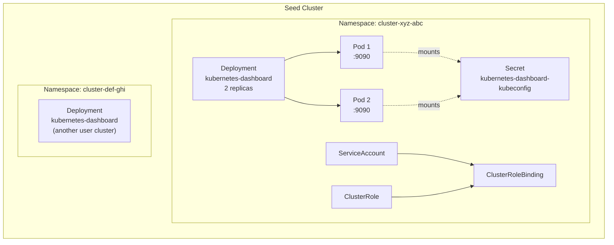

### Deployment Specification

| Property | Value |
|----------|-------|
| **Image** | `kubernetesui/dashboard:v2.7.0` |
| **Container Port** | `9090` (HTTP, insecure login) |
| **Label Selector** | `app=kubernetes-dashboard` |
| **Replicas** | 2 (with anti-affinity) |
| **Auth** | Mounted kubeconfig secret (`kubernetes-dashboard-kubeconfig`) |
| **Flags** | `--enable-insecure-login` |
| **Health Tracking** | `ClusterHealth.KubernetesDashboard` |
| **Enabled by Default** | Yes (`ClusterSpec.KubernetesDashboard.Enabled = true`) |

### How it gets deployed

The cluster controller in the kubermatic repo reconciles the `Cluster` CR. When `KubernetesDashboard.Enabled` is true, it creates the Deployment, Service, RBAC, and Secret resources in the cluster's seed namespace. When the cluster is deleted, `deletion.go` cleans up these resources.

---

## 3. API Proxy Layer

> Repository: `kubermatic/dashboard` -- Package: `modules/api/pkg/handler/v2/kubernetes-dashboard/`

The Go API acts as a **reverse proxy** between the user's browser and the Kubernetes Dashboard pod running in the seed cluster. This involves OIDC authentication and port-forwarding.

### Handler Files

```
modules/api/pkg/handler/v2/kubernetes-dashboard/
    handler.go      -- Base handler interface, isEnabled() global settings check
    login.go        -- OIDC login redirect and callback endpoints
    proxy.go        -- Reverse proxy via port-forward to dashboard pod
    director.go     -- Strips KKP API prefix, sets Authorization header
    request.go      -- Request types (InitialRequest, OIDCCallbackRequest, ProxyRequest)
    response.go     -- Response types carrying tokens and OIDC state
```

### Route Registration

File: `modules/api/pkg/handler/v2/routes_v2.go` (lines 1137-1157)

```
Login Handler:
  GET /api/v2/dashboard/login?projectID={}&clusterID={}    --> OIDC redirect
  GET /api/v2/dashboard/login?state={}&code={}             --> OIDC callback

Proxy Handler:
  GET /api/v2/projects/{id}/clusters/{id}/dashboard/proxy?token={}  --> Store token in cookie
  *   /api/v2/projects/{id}/clusters/{id}/dashboard/proxy/**        --> Reverse proxy
```

### Port-Forward Mechanism

From `proxy.go` (lines 219-251):

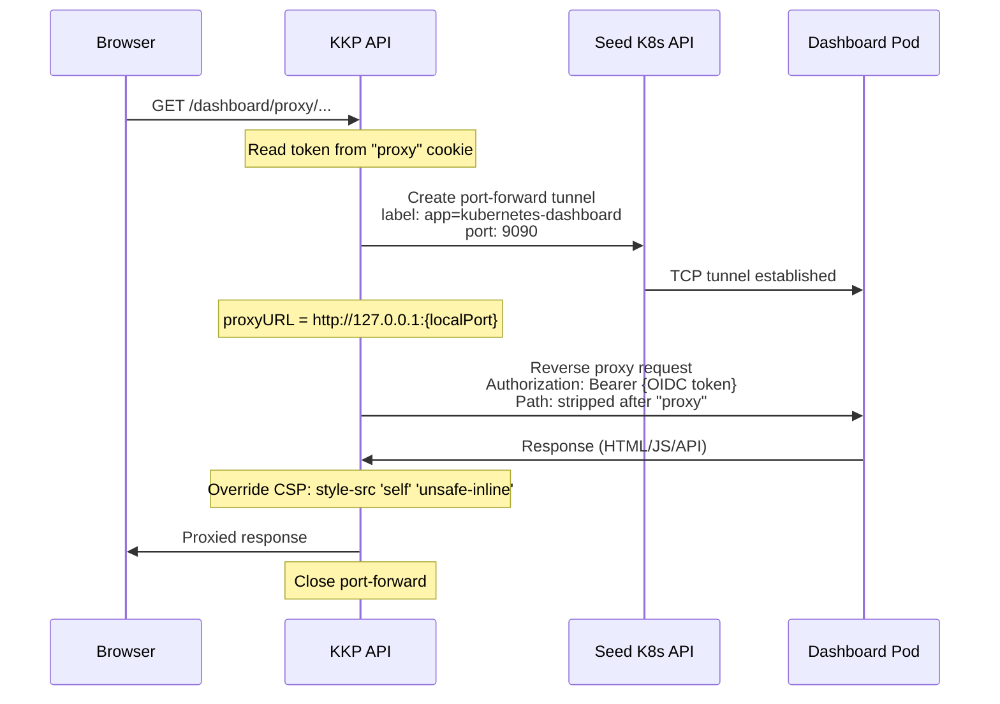

**Important**: A new port-forward is opened **per request**. There is a TODO comment in the code to cache these for better performance.

### Path Rewriting (director.go)

The `getBasePath()` function strips everything before "proxy" in the URL path:

```
Input:  /api/v2/projects/abc/clusters/xyz/dashboard/proxy/api/v1/pods
Output: /api/v1/pods

Input:  /api/v2/projects/abc/clusters/xyz/dashboard/proxy/
Output: /
```

### Key Constants (imported from kubermatic repo)

```go
import kubernetesdashboard "k8c.io/kubermatic/v2/pkg/resources/kubernetes-dashboard"

// Used to find and port-forward to the dashboard pod:
kubernetesdashboard.AppLabel      // "kubernetes-dashboard" (pod label selector)
kubernetesdashboard.ContainerPort // 9090 (HTTP port)
```

---

## 4. Frontend Layer

> Repository: `kubermatic/dashboard` -- Module: `modules/web/`

### Components Involved

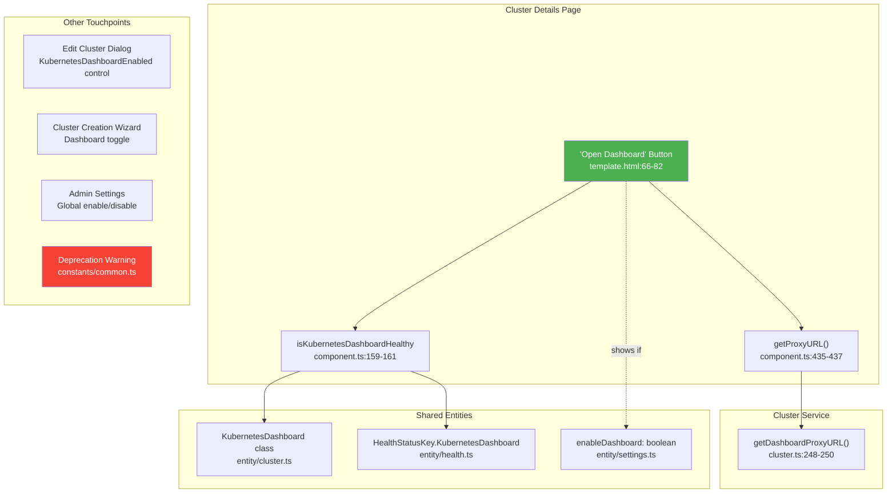

### File-by-File Details

| File | What it does |
|------|-------------|
| `cluster/details/cluster/template.html:66-82` | "Open Dashboard" button with `[href]="getProxyURL()"`, `target="_blank"`, disabled when unhealthy. Shows deprecation warning icon. |
| `cluster/details/cluster/component.ts:159-161` | `isKubernetesDashboardHealthy` getter: checks `cluster.spec.kubernetesDashboard.enabled && health.kubernetesDashboard === HealthState.Up` |
| `cluster/details/cluster/component.ts:435-437` | `getProxyURL()` delegates to `ClusterService.getDashboardProxyURL()` |
| `core/services/cluster.ts:248-250` | `getDashboardProxyURL()` returns `${restRoot}/dashboard/login?projectID=...&clusterID=...` |
| `shared/entity/cluster.ts` | `KubernetesDashboard` class with `enabled?: boolean` field |
| `shared/entity/health.ts` | `kubernetesDashboard?: HealthState` in health entity |
| `shared/entity/settings.ts:36` | `enableDashboard: boolean` in `AdminSettings` |
| `shared/constants/common.ts:22-23` | `KUBERNETES_DASHBOARD_DEPRECATED_MESSAGE` constant |
| `cluster/details/cluster/edit-cluster/` | Form control for enabling/disabling dashboard per cluster |
| `wizard/step/cluster/component.ts` | Dashboard toggle in cluster creation wizard |
| `settings/admin/defaults/` | Global admin toggle (requires OIDC kubeconfig endpoint + OpenID auth plugin) |

---

## 5. End-to-End Flow

Complete flow from user click to seeing the Kubernetes Dashboard:

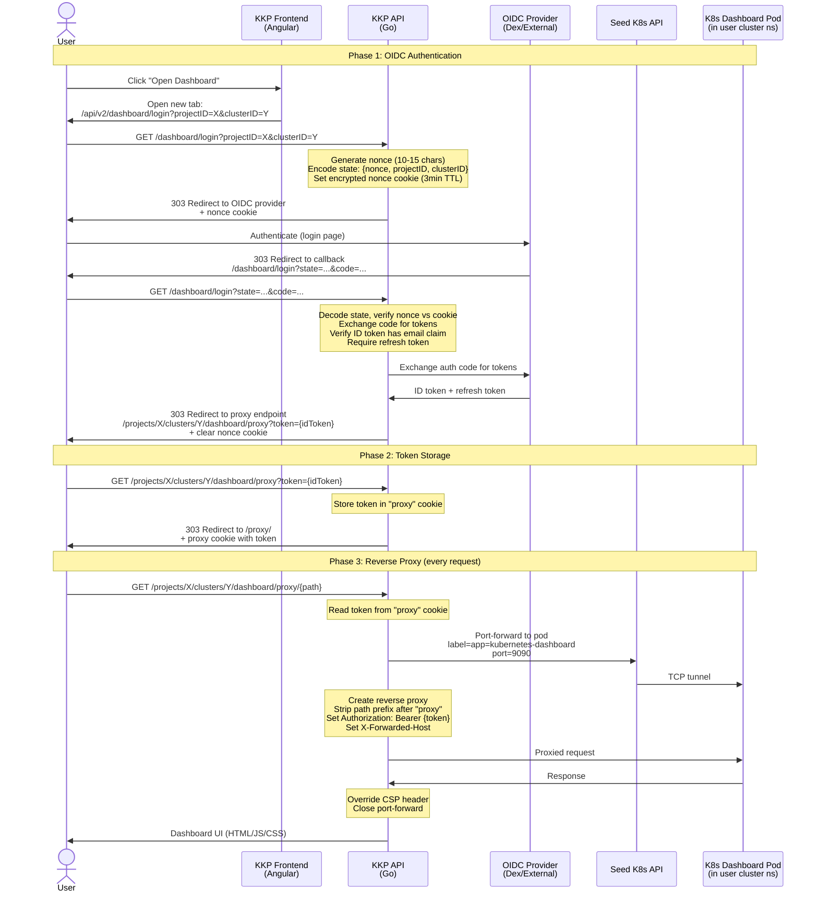

---

## 6. Headlamp Overview

[Headlamp](https://github.com/kubernetes-sigs/headlamp) is the actively maintained successor to Kubernetes Dashboard under `kubernetes-sigs`.

### Architecture Comparison

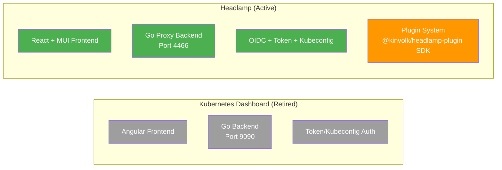

### Feature Comparison

| Aspect | K8s Dashboard (Retired) | Headlamp (Active) |
|--------|------------------------|-------------------|
| **Status** | Archived, unmaintained | Active SIG project |
| **Frontend** | Angular | React + MUI |
| **Backend** | Go | Go (proxy-based) |
| **Default Port** | 9090 | 4466 |
| **Multi-cluster** | Single cluster only | Native multi-cluster |
| **Extensibility** | No plugin system | Rich plugin API |
| **Auth** | Token/kubeconfig | OIDC, tokens, kubeconfig |
| **RBAC** | Basic view | Enhanced visualization |
| **Helm Chart** | N/A | Official chart available |
| **Container Args** | `--enable-insecure-login` | `-in-cluster`, `-plugins-dir` |

---

## 7. Migration Challenges

### Challenge Map

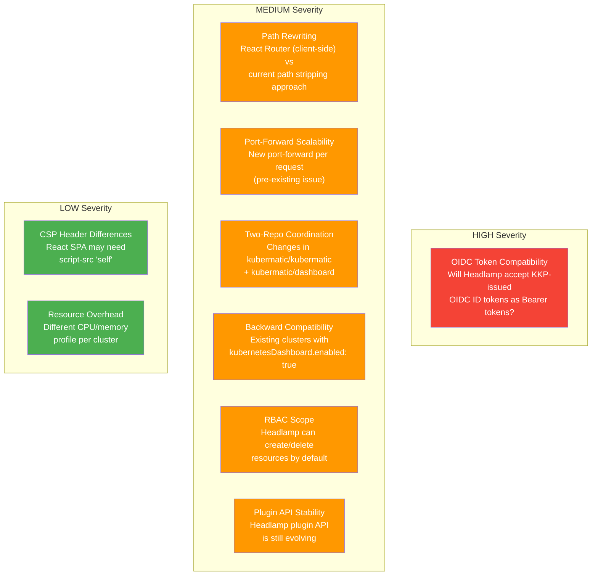

### Detailed Challenge Breakdown

#### 1. OIDC Token Compatibility (HIGH)

**Current flow**: KKP API performs OIDC login, obtains ID token, stores it in a cookie, and passes it as `Authorization: Bearer {token}` to the K8s Dashboard.

**Challenge**: Headlamp has its own OIDC support. When KKP mediates auth and passes a Bearer token, Headlamp must accept it without trying to do its own OIDC flow. Need to verify Headlamp's token acceptance behavior in proxy/passthrough mode.

**Mitigation**: Prototype early -- deploy Headlamp in a test cluster, verify the existing OIDC flow works with Headlamp's token acceptance.

#### 2. Path Rewriting Compatibility (MEDIUM)

**Current approach**: `director.go` strips everything before "proxy" in the URL path. The K8s Dashboard (Angular, server-side routing) handles this fine.

**Challenge**: Headlamp uses React Router (client-side routing). When the browser requests `/some/deep/path`, Headlamp needs to serve its `index.html` and let React Router handle the path. This requires Headlamp's `-base-url` flag to match the proxy path prefix.

**Mitigation**: Configure Headlamp with `-base-url` matching the KKP proxy prefix. Test navigation within the proxied Headlamp.

#### 3. Port-Forward Scalability (MEDIUM)

**Current code** (`proxy.go:220-221`):
```go
// Ideally we would cache these to not open a port for every single request
portforwarder, closeChan, err := common.GetPortForwarder(...)
```

Each proxied request opens a new port-forward to the dashboard pod and closes it after the response. This is inefficient for SPAs that make many API calls.

**Mitigation**: Implement port-forward caching/pooling. This is a pre-existing issue not introduced by migration, but Headlamp's more API-heavy frontend may make it more noticeable.

#### 4. Two-Repo Coordination (MEDIUM)

Changes must be synchronized across:
- `kubermatic/kubermatic`: Deployment manifests, image, labels, ports, RBAC, health checks, deletion
- `kubermatic/dashboard`: Proxy handler, login flow, frontend UI

Both PRs need to be merged and released together.

#### 5. Backward Compatibility (MEDIUM)

Existing clusters have `kubernetesDashboard.enabled: true` with the old K8s Dashboard deployed. On KKP upgrade, the cluster controller needs to:
- Clean up old K8s Dashboard resources (Deployment, Service, RBAC)
- Deploy new Headlamp resources
- Update health check labels/selectors

#### 6. RBAC Scope Expansion (MEDIUM)

K8s Dashboard in KKP is read-oriented. Headlamp by default allows creating/deleting resources through its UI. The RBAC setup may need review:
- Should we keep the same restrictive RBAC as K8s Dashboard?
- Or allow broader permissions matching Headlamp's capabilities?

#### 7. CSP Header Differences (LOW)

Current CSP in `proxy.go:41`:
```go
const csp = "style-src 'self' 'unsafe-inline';"
```

Headlamp's React SPA may additionally need `script-src 'self'` in the Content-Security-Policy header.

---

## 8. Required Changes Per Repository

### 8.1 kubermatic/kubermatic

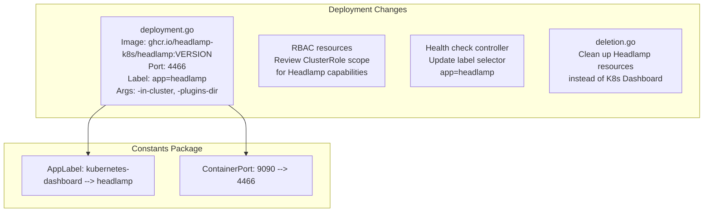

| File | Change |
|------|--------|
| `pkg/resources/kubernetes-dashboard/deployment.go` | Change image, port, labels, container args, volume mounts, probes |
| `pkg/resources/kubernetes-dashboard/` (constants) | `AppLabel`: `kubernetes-dashboard` -> `headlamp`, `ContainerPort`: `9090` -> `4466` |
| RBAC resources | Review and update ClusterRole/ClusterRoleBinding scope |
| Health check controller | Update label selector for pod health monitoring |
| `deletion.go` | Update resource cleanup for Headlamp |
| Liveness/readiness probes | Update path (Headlamp serves on `/`) |

### 8.2 kubermatic/dashboard - Go API

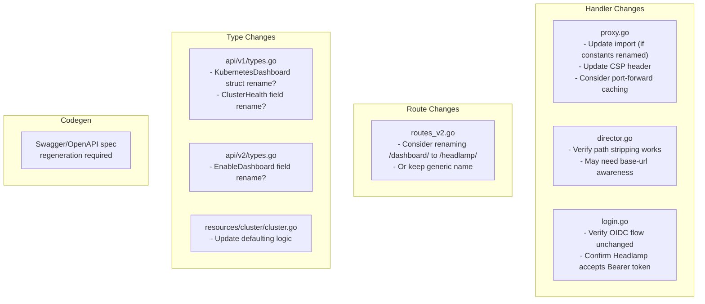

| File | Change |
|------|--------|
| `pkg/handler/v2/kubernetes-dashboard/proxy.go` | Update CSP header, consider port-forward caching |
| `pkg/handler/v2/kubernetes-dashboard/director.go` | Verify path stripping compatibility with React Router |
| `pkg/handler/v2/kubernetes-dashboard/login.go` | Verify OIDC flow works with Headlamp |
| `pkg/handler/v2/routes_v2.go:1137-1157` | Consider renaming routes from `/dashboard/` to `/headlamp/` |
| `pkg/api/v1/types.go` | Consider renaming `KubernetesDashboard` struct |
| `pkg/api/v2/types.go:2225` | Consider renaming `EnableDashboard` field |
| `pkg/resources/cluster/cluster.go:44-68` | Update defaulting logic |
| Swagger spec | Regenerate with `make update-codegen` |

### 8.3 kubermatic/dashboard - Angular Frontend

| File | Change |
|------|--------|
| `shared/entity/cluster.ts` | Rename `KubernetesDashboard` class or add `Headlamp` alongside |
| `shared/entity/health.ts` | Update `HealthStatusKey.KubernetesDashboard` enum |
| `shared/entity/settings.ts` | Rename `enableDashboard` or add `enableHeadlamp` |
| `cluster/details/cluster/component.ts` | Update `isKubernetesDashboardHealthy`, `getProxyURL()`, remove deprecation |
| `cluster/details/cluster/template.html:66-82` | Rename button text, update CSS classes, remove deprecation icon |
| `cluster/details/cluster/edit-cluster/` | Update form control and spec patch |
| `wizard/step/cluster/component.ts` | Update cluster creation toggle |
| `settings/admin/defaults/` | Update label from "Enable Kubernetes Dashboard" to "Enable Headlamp" |
| `core/services/cluster.ts:248-250` | Update `getDashboardProxyURL()` method and path |
| `shared/constants/common.ts:22-23` | Remove `KUBERNETES_DASHBOARD_DEPRECATED_MESSAGE` |
| Cypress E2E tests | Update selectors, page objects, fixture data |
| Swagger client models | Regenerate from updated swagger.json |

---

## 9. Recommended Approach

Based on the proposal document, the **Hybrid approach (Approach C)** with **feature-flag rollout** is recommended:

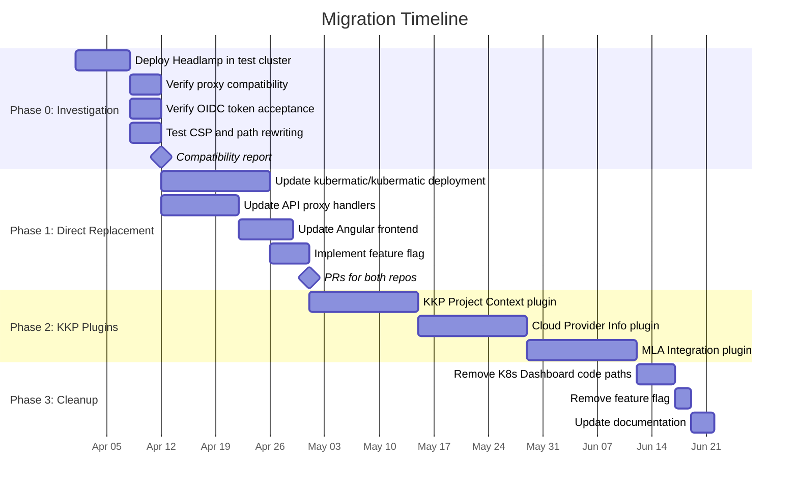

### Rollout Strategy: Feature Flag

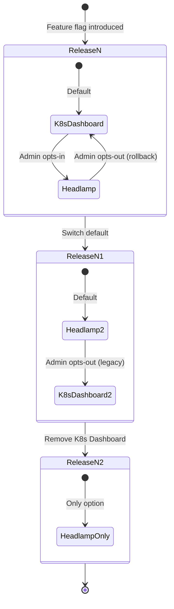

**Feature flag options** (pick one):
- **Option A**: `dashboardType` field in AdminSettings: `'kubernetes-dashboard' | 'headlamp'`
- **Option B**: Separate `enableHeadlamp` boolean alongside `enableDashboard`
- **Option C**: KKP `FeatureGates` configuration (e.g., `HeadlampDashboard`)

---

## 10. Open Questions

1. **API route naming**: Should `/dashboard/` change to `/headlamp/`, stay as-is, or use a generic name like `/cluster-ui/`?

2. **CRD field naming**: Should `KubernetesDashboard` in the CRD/API types be renamed to `ClusterDashboard` (generic) or `Headlamp` (specific)?

3. **OIDC mediation**: Does Headlamp's native OIDC support mean KKP could stop mediating auth? Or should KKP continue to control the login flow for consistency?

4. **Version pinning**: What Headlamp version should KKP target? Track latest, or pin per KKP release?

5. **Plugin distribution**: Bake KKP plugins into a custom container image (simpler) or load dynamically via ConfigMap (more flexible)?

6. **Deployment model**: Keep per-cluster deployment? Or move to a single Headlamp instance per seed with multi-cluster support?

7. **RBAC scope**: What are the RBAC implications of Headlamp's built-in capabilities (it can create/delete resources by default)?

---

## References

- Kubernetes Dashboard (Retired): https://github.com/kubernetes-retired/dashboard
- Headlamp Project: https://github.com/kubernetes-sigs/headlamp
- Headlamp Documentation: https://headlamp.dev/docs/latest/
- Headlamp Helm Chart: https://artifacthub.io/packages/helm/headlamp/headlamp
- Headlamp Plugin Development: https://headlamp.dev/docs/latest/development/plugins/
- KKP Documentation: https://docs.kubermatic.com/kubermatic/
- Tracking Issue: https://github.com/kubermatic/kubermatic/issues/15287
